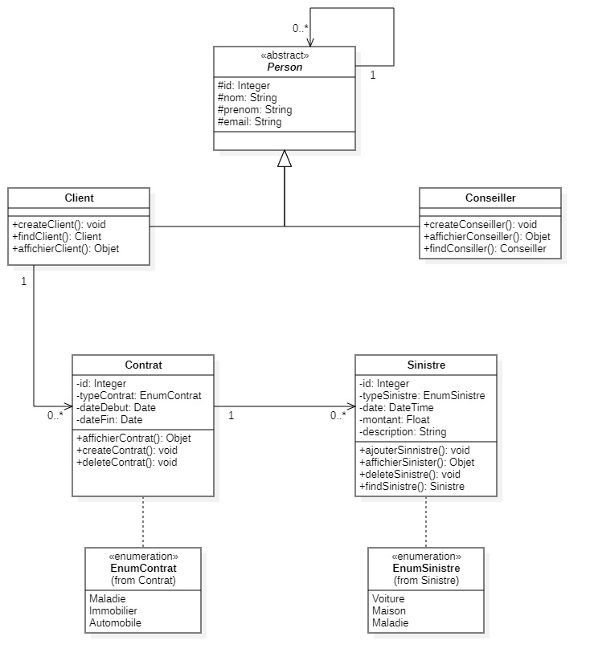

# 📋 Projet : Gestion de contrats d'assurance

## 🏢 Contexte du projet
Une société d’assurance souhaite digitaliser ses services. Ce projet consiste à implémenter une **application console** qui facilite la gestion des contrats et des sinistres pour la compagnie.

---

## 🎯 Objectifs
- Créer une application console fonctionnelle pour gérer les **assurés** et leurs **sinistres**.
- Introduire et appliquer les concepts de **programmation fonctionnelle en Java** :
    - ⚡ **Streams API** pour le traitement des collections.
    - 📝 **Expressions Lambda** et **Method References** pour simplifier le code.
    - 🔒 **Optional** pour la gestion sécurisée des valeurs nulles.

---

## 🖥️ Interface utilisateur

### 👨‍💼 Gérer les conseillers
- ➕ Ajouter un conseiller (ID généré automatiquement).
- ❌ Supprimer un conseiller par son ID.
- 🔍 Rechercher un conseiller par son ID.
- 📋 Afficher la liste des clients d’un conseiller par l’ID du conseiller (Stream API).

### 🧑‍🤝‍🧑 Gérer les clients
- ➕ Ajouter un client (ID généré automatiquement).
- ❌ Supprimer un client par son ID.
- 🔍 Rechercher un client par son **nom de famille**, trié par ordre alphabétique (Stream API).
- 🔎 Rechercher un client par son ID (Optional).
- 📋 Afficher les contrats souscrits d’un client donné par l’ID du client.
- 📂 Afficher la liste des sinistres par l’ID d’un client (Stream API).

### 📄 Gérer les contrats
- ➕ Ajouter un contrat (ID généré automatiquement, rattachement à un client via ID).
- ℹ️ Afficher les informations d’un contrat par ID (Optional).
- ❌ Supprimer un contrat par son ID.
- 📋 Afficher la liste des sinistres d’un contrat (Stream API).

### 💥 Gérer les sinistres
- ➕ Ajouter un sinistre (ID généré automatiquement, rattachement à un contrat via ID).
- ❌ Supprimer un sinistre par son ID.
- 💰 Calculer les coûts totaux des sinistres déclarés d’un client (Stream API).
- 🔎 Rechercher un sinistre par son ID (Optional).
- 📉 Afficher la liste des sinistres triés par montant décroissant (Stream API).
- ⏰ Afficher les sinistres survenus avant une date donnée (Stream API).
- 💵 Afficher les sinistres dont le coût est supérieur à un montant donné (Stream API).

---

## 🏗️ Structure de l’application

### 📦 Couche **Model**
- **Person** : nom, prénom, email.
- **Conseiller** <extends Person>.
- **Client** <extends Person> : rattachement à un conseiller.
- **Contrat** : id, typeContrat (ENUM), dateDebut, dateFin, client.
- **Sinistre** : id, typeSinistre (ENUM), dateTime, coût, description, contrat.

### 📑 Couche **Enum**
- Types de contrats : `Automobile`, `Maison`, `Maladie`.
- Types de sinistres : `Accident voiture`, `Accident maison`, `Maladie`.

### 🖼️ Couche **View**
- **ConsiellerView** : menus et sous-menus conseiller.
- **ClientView** : menus et sous-menus clients.
- **ContratView** : menus et sous-menus contrats.
- **SinistreView** : menus et sous-menus sinistres.

### 🖱️ Couche **Controller**
- **ConseillerController** : interaction entre la vue et le service conseiller.
- **ClientController** : interaction entre la vue et le service client.
- **ContratController** : interaction entre la vue et le service contrat.
- **SinistreController** : interaction entre la vue et le service sinistre.

### ⚙️ Couche **Service**
- Contient les méthodes **CRUD** et les méthodes de **filtrage/tri**.
- Services disponibles :
    - **ConseillerService**
    - **ClientService**
    - **ContratService**
    - **SinistreService**
- La logique métier est implémentée uniquement dans les services. Les contrôleurs appellent ces services, et les vues affichent les résultats.

### 💾 Couche **Repository**
- Communication avec la base de données via JDBC.
- Méthodes CRUD pour :
    - **ConseillerRepository**
    - **ClientRepository**
    - **ContratRepository**
    - **SinistreRepository**

---

## 🏗️ Conception

### 📊 Diagramme de classes
- Visualisation des relations entre les entités du projet :  
  

---

## 🛠️ Spécifications techniques
- Utiliser **JDBC** pour la persistance des modèles.
- Java 8.
- Respect de l’**encapsulation** : propriétés privées avec getters et setters.
- Exploitation de l’**API Streams** pour le traitement des collections.
- Gestion des valeurs absentes avec **Optional**.
- Intégration de **Java Time API** pour les dates de sinistres et de contrats.
- Utilisation de **Lambdas** et **Method References** pour simplifier le code.  
